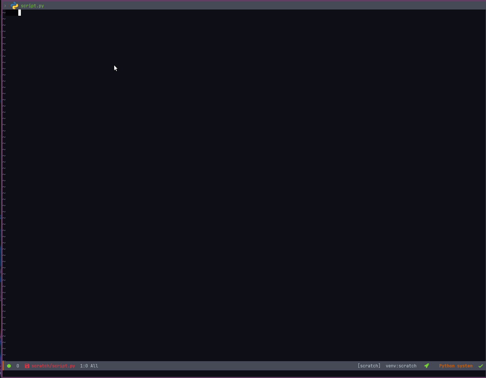

# pycode-cells
A minimal "jupyter notebook"-like experience on Emacs. 


## Installation
**Doom Emacs**

- Clone this repository
- Add below to your `package.el` file
  ``` emacs-lisp
  (package! python-cells
    :recipe (:local-repo "/path/to/repo/pycode-cells"))
  ```
- Add below to your `config.el` file
  ``` emacs-lisp
  (use-package pycode-cells)
  ```
- Update Doom
  ``` sh
  doom sync
  ```

## Configure
Nothing special to configure. Below is an arbitrary keybindings for some of the lib commands.
``` emacs-lisp
(map! "C-c a" #'pycode-cells-add-above)
(map! "C-c b" #'pycode-cells-add-below)
(map! "C-c C-b" #'pycode-cells-send-cell)
(map! "C-c s" #'pycode-cells-send-cell-add)
```
